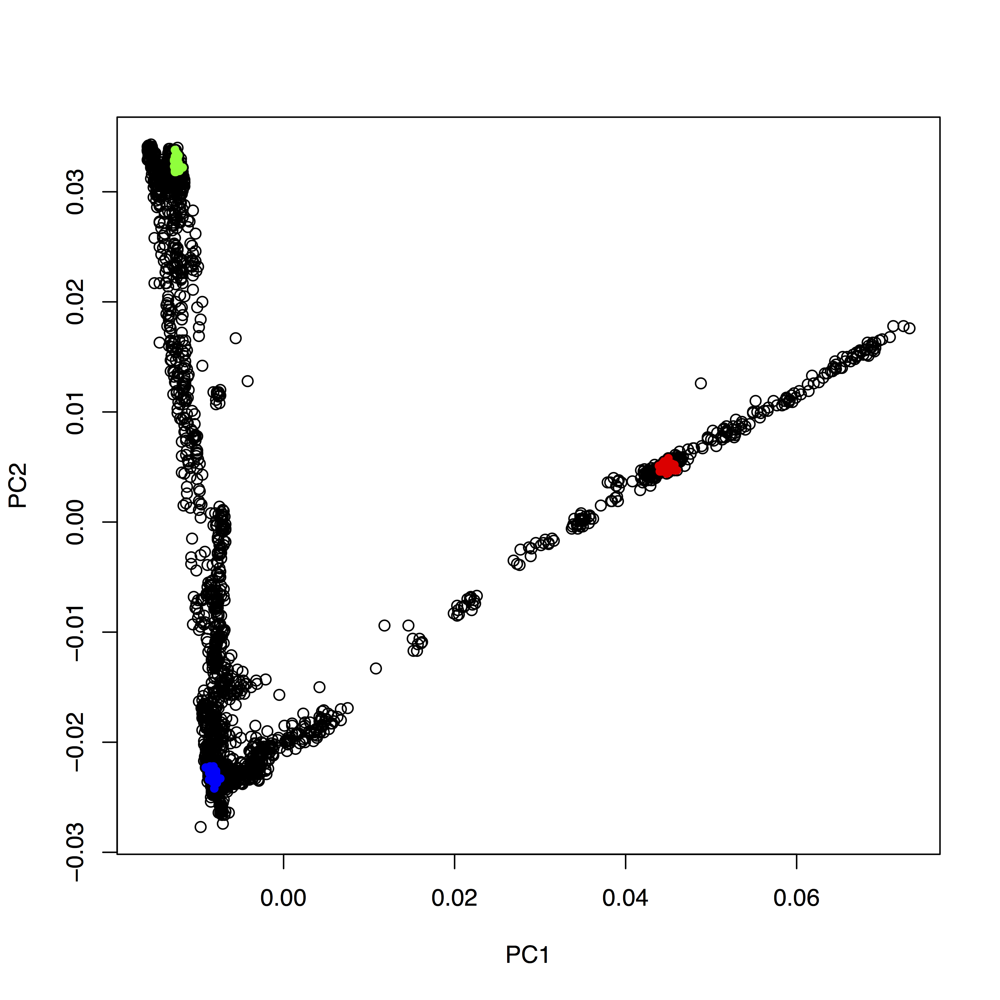
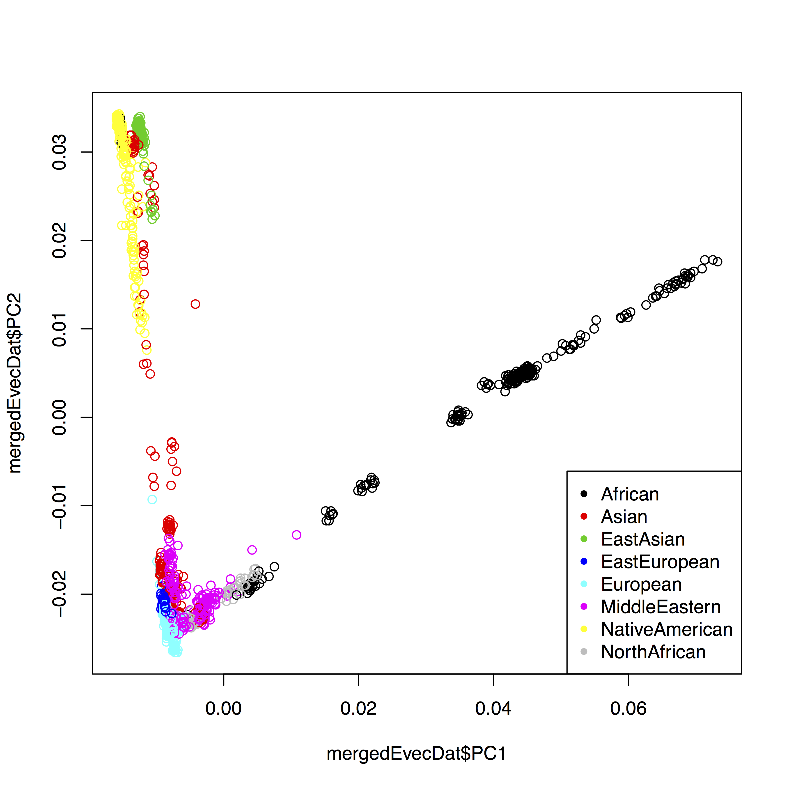
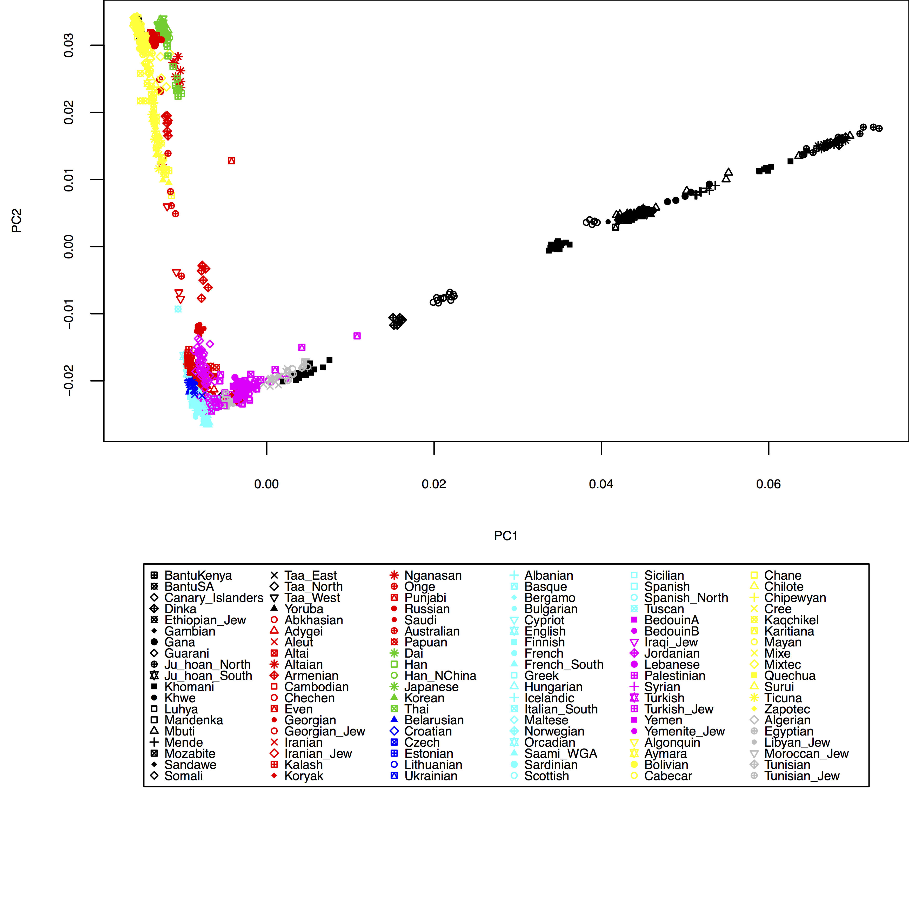

.. _pca:

Principal Component Analysis
============================

In this lesson we'll make a principal component plot. For that we will use the program ``smartpca``, again from the `Eigensoft package <https://data.broadinstitute.org/alkesgroup/EIGENSOFT/>`_. The recommended way to perform PCA involving low coverage test samples, is to construct the Eigenvectors only from the high quality set of modern samples in the HO set, and then simply project the ancient or low coverage samples onto these Eigenvectors. This allows one to project even samples with as few as 10,000 SNPs into PCA plot (compare with ~600,000 SNPs for HO samples).

Running SmartPCA
----------------

So the first thing to decide is on the populations used to construct the PCA. You can find a complete list of HO population at ``/projects1/users/schiffels/PublicData/HumanOriginsData.backup/HO_populations.txt``. You can in principle use all of these populations to construct the EigenVectors. Note however that this will fill the first principal components with global human diversity axes, like African/Non-African, Asian/Europe, Native Americans... So it depends on your particular research question on whether you want to narrow down the populations used to construct the PCA. For example, if you are working on Native American samples, you may want to consider running a PCA with only Native American and perhaps Siberian populations. You can also make several runs with different subsets of populations of course.

In any case, if you want to restrict the samples used for contructing the PCA, you should copy the populations file above to your directory and modify it accordingly, i.e. remove populations you do not want. At the very least, I recommend removing the following "populations": Chimp, Denisovan, Gorilla, hg19ref, Iceman, LaBrana, LBK, Loschbour, MA1, Macaque, Marmoset, Mezmaiskaya, Motala, Orangutan, Saqqaq, Swedish Farmer, Swedish HunterGatherer, Vindija light.

Now we need to build a parameter file for ``smartpca``. Mine looks like this::

    genotypename:	/data/schiffels/GAworkshop/genotyping/MyProject.HO.eigenstrat.merged.geno.txt
    snpname:	/data/schiffels/GAworkshop/genotyping/MyProject.HO.eigenstrat.merged.snp.txt
    indivname:	/data/schiffels/GAworkshop/genotyping/MyProject.HO.eigenstrat.merged.ind.txt
    evecoutname:	/data/schiffels/GAworkshop/pca/MyProject.HO.merged.pca.evec.txt
    evaloutname:	/data/schiffels/GAworkshop/pca/MyProject.HO.merged.pca.eval.txt
    poplistname:	/home/adminschif/GAworkshop/pca_populations.txt
    lsqproject:	YES

The first three lines contain the three genotype files you generated from merging your test samples with the HO data set, so the output of the ``mergeit`` program. The next two lines are two output files, and you have to make sure the directory where these two files will be written into exists. The next line contains a file with the list of populations that you want to use to construct the PCA, as discussed above. The last line contains a flag that is recommended for low coverage and ancient data.

You can now run ``smartpca`` on that parameter file and submit to SLURM via:

.. code-block:: bash

    sbatch --mem=8000 -o /data/schiffels/GAworkshop/pca/smartpca.log --wrap="smartpca -p smartpca.params.txt"

Here I reserved 8GB of memory, which I would recommend for a large data set such as HO. Once finished, transfer the resulting ``*.evec.txt`` file back to your laptop.

Plotting the results
--------------------

There are several ways to make nice publication-quality plots (Excel is usually not one of them). Popular tools include `R <https://www.r-project.org>`_, `matplotlib <http://matplotlib.org>`_. A relatively new development which is highly recommended is the `Jupyter Notebook <http://jupyter.org>`_, which can be used with both R, matplotlib and many other scientific compute environments. I personally also heavily use the commercial software `DataGraph <http://www.visualdatatools.com/DataGraph/>`_, you can download a free demo if you are interested. To keep it simple, here we will simply use R, because it works right out of the box and has an easy installation. So please go ahead and install R from the website if you don't have it already installed.

When you startup R, you get the console, into which you can interactively type commands, including plot commands, and look at the results on a screen. Here are my first two commands:

.. code-block:: bash

    fn = "~/Data/GAworkshop/pca/MyProject.HO.merged.pca.evec.txt"
    evecDat = read.table(fn, col.names=c("Sample", "PC1", "PC2", "PC3", "PC4", "PC5",
                                         "PC6", "PC7", "PC8", "PC9", "PC10", "Pop"))

where ``fn`` obviously should point to the ``*.evec.txt`` file produced from ``smartpca``. The ``read.table`` command reads the data into a so called "DataFrame", which is pretty much an ordinary table with some extra features. We explicitly say what the 12 column names should be in the command, as you can see. The first column is the Sample name, the last is the population name, and the middle 10 columns denote the 10 first principle components for all samples. You can have a look at the data frame by typing ``head(evecDat)``, which should yield::

        Sample    PC1    PC2     PC3     PC4     PC5     PC6     PC7     PC8     PC9    PC10      Pop
    1   SA1004 0.0549 0.0100 -0.0502 -0.0016  0.0003  0.0009  0.0016  0.0409 -0.0368 -0.0625  Khomani
    2    SA064 0.0502 0.0083 -0.0619 -0.0038  0.0020  0.0016  0.0055  0.0664 -0.0424 -0.0878  Khomani
    3    SA073 0.0552 0.0110 -0.0600 -0.0043  0.0007 -0.0001  0.0007  0.0411 -0.0393 -0.0868  Khomani
    4    SA078 0.0465 0.0058 -0.0749 -0.0024 -0.0041  0.0011 -0.0101  0.0307 -0.0330 -0.0671  Khomani
    5    SA083 0.0418 0.0047 -0.0631 -0.0040  0.0041  0.0004  0.0035  0.0620 -0.0372 -0.0855  Khomani
    6 BOT2.031 0.0668 0.0148 -0.0888 -0.0040 -0.0011 -0.0027 -0.0068 -0.0310  0.0096  0.0072 Taa_West

You see that it's pretty much a table. You can now very easily produce a plot of PC1 vs. PC2, by typing ``plot(evecDat$PC1, evecDat$PC2, xlab="PC1", ylab="PC2")``, which in my case yields a boring figure like this:

.. image:: pca_simple.png
   :width: 500px
   :height: 500px
   :align: center

Now, obviously, we would like to highlight the different populations by color. A quick and dirty solution is to simply plot different subsets of the data on top of each other, like this::

    plot(evecDat$PC1, evecDat$PC2, xlab="PC1", ylab="PC2")
    d = evecDat[evecDat$Pop=="Yoruba",]
    points(d$PC1, d$PC2, col="red", pch=20)
    d = evecDat[evecDat$Pop=="French",]
    points(d$PC1, d$PC2, col="blue", pch=20)
    d = evecDat[evecDat$Pop=="Han",]
    points(d$PC1, d$PC2, col="green", pch=20)

You can copy and paste all those lines simultaneously into the console, by the way. This sequence of commands gives us:

OK, but how do we systematically show all the interesting populations? In principle, R makes this easily possible: Instead of choosing a single color and symbols (the ``col`` and ``pch`` options), you can give R vectors to these options, which contain one value for each sample. To make this clearer, run ``plot(evecDat$PC1, evecDat$PC2, col=evecDat$Pop)``, which should produce a _very_ colorful, but also useless, plot, where each population has its own color (although R cycles only 8 colors, so you will have every color used for many populations). OK, this is not useful. We should have a broader categorization into continental groups.

The way I have come up with first involves making a new tabular file with two columns, to denote the continental groups that the populations are in, like this::

    BantuKenya	African
    BantuSA	African
    Canary_Islanders	African
    Dinka	African
    Ethiopian_Jew	African
    Mayan	NativeAmerican
    Mixe	NativeAmerican
    Mixtec	NativeAmerican
    Quechua	NativeAmerican
    Surui	NativeAmerican
    Ticuna	NativeAmerican
    Zapotec	NativeAmerican
    Algerian	NorthAfrican
    Egyptian	NorthAfrican
    Libyan_Jew	NorthAfrican
    Moroccan_Jew	NorthAfrican
    Tunisian	NorthAfrican
    Tunisian_Jew	NorthAfrican
    ...

The names in the first column should be taken from the population names in your merged ``*.ind.txt`` file that you input to ``smartpca``. An example file can be found in the Google Drive folder under ``HO_popGroups.txt``. You can load this file into a data frame in R via::

    popGroups=read.table("~/Google_Drive/Projects/GAworkshopScripts/HO_popGroups.txt", col.names=c("Pop", "PopGroup"))

You can again convince yourself that it worked by typing ``head(popGroups)``. We can now make use of a very convenient feature in R which lets us easily merge two data frames together. What we need is a new data frame which consists of the ``evecDat`` data frame, but with an additional column indicating the continental group. This involves a lookup in ``popGroups`` for every population in ``evecDat``. This command does the job::

    mergedEvecDat = merge(evecDat, popGroups, by="Pop")

You can see via ``head(mergedEvecDat)``::

            Pop Sample     PC1     PC2     PC3     PC4    PC5     PC6    PC7     PC8     PC9    PC10 PopGroup
    1 Abkhasian abh107 -0.0080 -0.0211 -0.0040 -0.0003 0.0073 -0.0025 0.0096 -0.0204 -0.0052 -0.0126    Asian
    2 Abkhasian abh133 -0.0077 -0.0217 -0.0043 -0.0006 0.0073 -0.0022 0.0081 -0.0222 -0.0053 -0.0137    Asian
    3 Abkhasian abh119 -0.0077 -0.0214 -0.0041 -0.0009 0.0057 -0.0019 0.0109 -0.0205 -0.0043 -0.0147    Asian
    4 Abkhasian abh122 -0.0078 -0.0214 -0.0039 -0.0017 0.0050 -0.0015 0.0082 -0.0171 -0.0042 -0.0116    Asian
    5 Abkhasian  abh27 -0.0077 -0.0218 -0.0039 -0.0011 0.0039 -0.0024 0.0076 -0.0205 -0.0055 -0.0121    Asian
    6 Abkhasian  abh41 -0.0077 -0.0209 -0.0046 -0.0015 0.0054 -0.0028 0.0047 -0.0208 -0.0078 -0.0130    Asian

that there now is a new column to the right called ``PopGroup``, which correctly contains the group for each sample. Note that this new dataframe only contains rows with populations that are actually in your original ``popGroups`` data set, so in the file you created. You can see this by running ``nrow``::

    > nrow(mergedEvecDat)
    [1] 1306
    > nrow(evecDat)
    [1] 2257

You see that in my case the ``mergedEvecDat`` only contains 1306 samples, whereas the full data set had 2257 samples. So you can use this to select specific populations you would like to have plotted.

OK, so now, as a first step, we can improve our simple first plot by using the color to indicate the continental group::

    plot(mergedEvecDat$PC1, mergedEvecDat$PC2, col=mergedEvecDat$PopGroup)
    legend("bottomright", legend=levels(mergedEvecDat$PopGroup), col=1:length(levels(mergedEvecDat$PopGroup)), pch=20)

The final solution for me was to also separate populations by symbol, which involves a bit more hacking. First, to use different symbols for different populations, you can give a simple vector of symbols to the ``plot`` command via ``pch=as.integer(mergedEvecDat$Pop) %% 24``. The trick here is that first you convert ``mergedEvecDat$Pop`` to an integer enumerating all populations, and then you use the ``modulo`` operation to cycle through 24 different numbers. The complete solution in my case looks like this:

.. code-block:: R

    fn = "~/Data/GAworkshop/pca/MyProject.HO.merged.pca.evec.txt"
    evecDat = read.table(fn, col.names=c("Sample", "PC1", "PC2", "PC3", "PC4", "PC5",
                                         "PC6", "PC7", "PC8", "PC9", "PC10", "Pop"))
    popGroups=read.table("~/Google_Drive/Projects/GAworkshopScripts/HO_popGroups.txt", col.names=c("Pop", "PopGroup"))
    mergedEvecDat = merge(evecDat, popGroups, by="Pop")

    layout(matrix(c(1,2), ncol=1), heights=c(1.5, 1))
    par(mar=c(4,4,0,0))
    plot(mergedEvecDat$PC1, mergedEvecDat$PC2, col=mergedEvecDat$PopGroup, pch=as.integer(mergedEvecDat$Pop) %% 24, cex=0.6, cex.axis=0.6, cex.lab=0.6, xlab="PC1", ylab="PC2")
    plot.new()
    par(mar=rep(0, 4))
    legend("center", legend=popGroups$Pop, col=popGroups$PopGroup, pch=as.integer(popGroups$Pop) %% 24, ncol=6, cex=0.6)

which produces:

Of course, here I haven't yet included my test individuals, but you can see easily how to include them in the ``HO_popGroups.txt`` file. Also, in ``plot`` you can use the ``xlim`` and ``ylim`` options to zoom into specific areas of the plot, e.g. try ``xlim=c(-0.01,0.01), ylim=c(-0.03,-0.01)`` in the ``plot`` command above.
