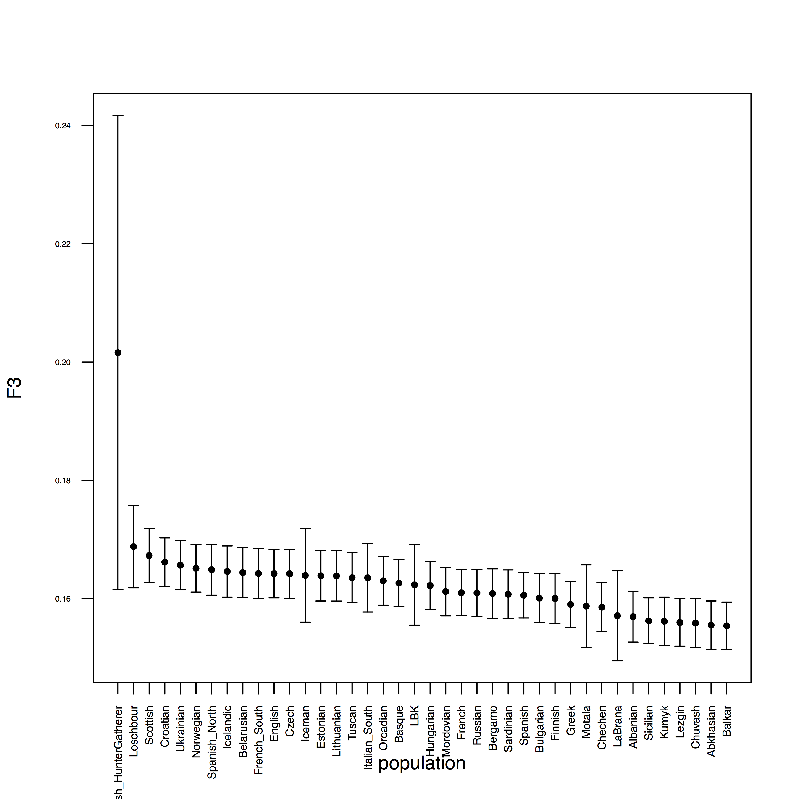

.. _f3:

Outgroup F3 Statistics
======================

Outgroup F3 statistics are a useful analytical tool to understand population relationships. F3 statistics, just as F4 and F2 statistics measure allele frequency correlations between populations and were introduced by Nick Patterson in his `2012 paper <http://www.genetics.org/content/early/2012/09/06/genetics.112.145037>`_.

F3 statistics are used for two purposes:
i) as a test whether a target population (C) is admixed between two source populations (A and B), and
ii) to measure shared drift between two test populations (A and B) from an outgroup (C). In this session we'll use the second of these use cases.

F3 statistics are in both cases defined as the product of allele frequency differences between population C to A and B, respectively::

    F3=<(c-a)(c-b)>

Here, ``<>`` denotes the average over all genotyped sites, and ``a``, ``b`` and ``c`` denote the allele frequency in the three populations. Outgroup F3 statistics measure the amount of _shared genetic drift_ between two populations from a common ancestor. In a phylogenetic tree connecting A, B and C, Outgroup F3 statistics measure the common branch length from the outgroup, here indicated in red:

.. image:: f3-tree.png
   :width: 300px
   :height: 300px
   :align: center

For computing F3 statistics including error bars, we will use the ``qp3Pop`` program from `Admixtools <https://github.com/DReichLab/AdmixTools>`_. You can have a look at the readme for that tool under ``/projects1/tools/adminxtools_3.0/README.3PopTest`` (the typo "adminx" is actually in the path).

The README and name of the tools is actually geared towards the first use case of F3 described above, the test for admixture. But since the formula is exactly the same, we can use the same tool for Outgroup F3 Statistics as well. One ingredient that you need is a list of population triples. This should be a file with three population names in each row, separated by space, e.g.::

    JK2134 AA Yoruba
    JK2134 Abkhasian Yoruba
    JK2134 Adygei Yoruba
    JK2134 AG2 Yoruba
    JK2134 Albanian Yoruba
    JK2134 Aleut Yoruba
    JK2134 Algerian Yoruba
    JK2134 Algonquin Yoruba
    JK2134 Altai Yoruba
    JK2134 Altaian Yoruba
    ...

Note that in this case the first population is a single sample, the second loops through all HO populations, and the third one is a fixed outroup, here Yoruba. For Non-African population studies you can use "Mbuti" as outgroup, which is commonly used as an unbiased outgroup to all Non-Africans.

Analysing groups of samples (populations)
-----------------------------------------

If you only analyse a single population, or a few, you can manually create lists of population triples. In that case, first locate the list of all Human Origins populations here: ``/projects1/users/schiffels/PublicData/HumanOriginsData.backup/HO_populations.txt``, and construct a file with the desired population triples using an awk-one-liner:

.. code-block:: bash

    awk '{print "YourPopulation", $1, "Mbuti"}' $HO_populations > $OUT

Here, "YourPopulation" should be replaced by the population in you ``*.ind.txt`` file that you want to focus on, and "Mbuti" is the outgroup (pick another one if appropriate). Then, construct a parameter file like this:

.. code-block::

    genotypename:   /data/schiffels/GAworkshop/genotyping/MyProject.HO.eigenstrat.merged.geno.txt
    snpname:   /data/schiffels/GAworkshop/genotyping/MyProject.HO.eigenstrat.merged.snp.txt
    indivname:   /data/schiffels/GAworkshop/genotyping/MyProject.HO.eigenstrat.ind.txt
    popfilename:  <YOUR_POPULATION_TRIPLE_LIST>
    
and run it via

.. code-block:: bash

    qp3Pop -p $PARAMETER_FILE > $OUT

Analysing individual samples
----------------------------

In my case, I selected 6 samples that showed low levels of contamination and chose to run them independently through F3 statistics. You may also choose to group test samples together into one population. In my case, I create 6 separate population lists like this:

.. code-block:: bash

    #!/usr/bin/env bash
    OUTDIR=/data/schiffels/GAworkshop//data/schiffels/GAworkshop/f3stats
    mkdir -p $OUTDIR
    for SAMPLE in JK2134 JK2918 JK2888 JK2958 JK2911 JK2972; do
        HO_POPLIST=/projects1/users/schiffels/PublicData/HumanOriginsData.backup/HO_populations.txt
        OUT=$OUTDIR/$SAMPLE.f3stats.poplist.txt
        awk -v s=$SAMPLE '{print s, $1, "Mbuti"}' $HO_POPLIST > $OUT
    done

Here, the ``awk`` command loops through all rows in ``$HO_POPLIST`` and prints it into a new row with the sample name (assigned as variable ``s`` in awk through a command line option ``-v s=$SAMPLE``), and "Mbuti" in last position. If you follow a similar approach of looping through multiple samples, you should check the output poplist files that they are correct.

Similar to the ``mergeit`` and the ``smartpca`` programs we have already used, ``qp3Pop`` requires a parameter file as input. In my case, for the first sample it looks like this::

    genotypename:   /data/schiffels/GAworkshop/genotyping/MyProject.HO.eigenstrat.merged.geno.txt
    snpname:   /data/schiffels/GAworkshop/genotyping/MyProject.HO.eigenstrat.merged.snp.txt
    indivname:   /data/schiffels/GAworkshop/genotyping/MyProject.HO.eigenstrat.ind.txt
    popfilename:  /data/schiffels/GAworkshop//data/schiffels/GAworkshop/f3stats/JK2134.f3stats.poplist.txt

Important: The ``qp3Pop`` program assumes that all population names in the ``popfilename`` are present in the ``*.ind.txt`` file of the input data, specifically in the third column of that file, which indicates the population. In my case, I intend to compute a separate statistic for each of my ancient samples individually, rather than an entire population. Therefore, I manually edited the ``*.ind.txt`` file an artificially assigned each of my individuals its own "population", which is simply called the same as the individual.

The first three lines of the parameter file specify the EIGENSTRAT data set, similar to what we put into the ``smartpca`` parameter file. The fourth parameter denotes the population list we generated above. In my case, I need to prepare 6 such parameter files and submit them all:

.. code-block:: bash

    #!/usr/bin/env bash

    INDIR=/data/schiffels/GAworkshop/genotyping
    OUTDIR=/data/schiffels/GAworkshop//data/schiffels/GAworkshop/f3stats
    for SAMPLE in JK2134 JK2918 JK2888 JK2958 JK2911 JK2972; do
        GENO=$INDIR/MyProject.HO.eigenstrat.merged.geno.txt
        SNP=$INDIR/MyProject.HO.eigenstrat.merged.snp.txt
        IND=MyProject.HO.eigenstrat.ind.txt
        POPLIST=$OUTDIR/$SAMPLE.f3stats.poplist.txt

        PARAMSFILE=$OUTDIR/$SAMPLE.f3stats.qp3Pop.params.txt
        printf "genotypename:\t$GENO\n" > $PARAMSFILE
        printf "snpname:\t$SNP\n" >> $PARAMSFILE
        printf "indivname:\t$IND\n" >> $PARAMSFILE
        printf "popfilename:\t$POPLIST\n" >> $PARAMSFILE

        LOG=$OUTDIR/$SAMPLE.qp3Pop.log
        OUT=$OUTDIR/$SAMPLE.qp3Pop.out
        sbatch --mem 4000 -o $LOG --wrap="qp3Pop -p $PARAMSFILE > $OUT"
    done

This should run for 10-20 minutes. When finished, transfer the resulting files to your laptop using ``scp``.

Plotting
--------

The output from ``qp3Pop`` looks like this::

    parameter file: /tmp/qp3Pop_wrapper35005211521595368
    ### THE INPUT PARAMETERS
    ##PARAMETER NAME: VALUE
    genotypename: /data/schiffels/MyProject/genotyping/MyProject.onlyTVFalse.HO.merged.geno
    snpname: /data/schiffels/MyProject/genotyping/MyProject.onlyTVFalse.HO.merged.snp
    indivname: /data/schiffels/MyProject/genotyping/MyProject.noGroups.onlyTVFalse.HO.merged.ind
    popfilename: /data/schiffels/MyProject/f3stats/JK2134.f3stats.poplist.txt
    ## qp3Pop version: 300
    nplist: 224
    number of blocks for block jackknife: 549
    snps: 593655
                          Source 1             Source 2               Target           f_3       std. err           Z    SNPs
     result:                JK2134                   AA               Yoruba      0.026824       0.001010      26.547   56353
     result:                JK2134            Abkhasian               Yoruba      0.147640       0.002229      66.231   56447
     result:                JK2134               Adygei               Yoruba      0.144566       0.002139      67.583   56467
     result:                JK2134                  AG2               Yoruba      0.139170       0.008287      16.794    9499
     result:                JK2134             Albanian               Yoruba      0.149385       0.002321      64.364   56435
     result:                JK2134                Aleut               Yoruba      0.134388       0.002287      58.768   56431
     result:                JK2134             Algerian               Yoruba      0.116380       0.002052      56.727   56416
     result:                JK2134            Algonquin               Yoruba      0.126845       0.002526      50.224   56396
     ...

The key rows are the ones starting with ``result:``. We can exploit that and select all relevant rows using ``grep``. In my case, I can even join the results across all samples using::

    grep 'result:' *.qp3Pop.out

assuming that I am executing this inside the directory where I copied the per-sample result files. When you run this, the output looks like this::

    JK2134.f3stats.txt: result:                JK2134                   AA               Yoruba      0.026824       0.001010      26.547   56353
    JK2134.f3stats.txt: result:                JK2134            Abkhasian               Yoruba      0.147640       0.002229      66.231   56447
    JK2134.f3stats.txt: result:                JK2134               Adygei               Yoruba      0.144566       0.002139      67.583   56467
    JK2134.f3stats.txt: result:                JK2134                  AG2               Yoruba      0.139170       0.008287      16.794    9499
    JK2134.f3stats.txt: result:                JK2134             Albanian               Yoruba      0.149385       0.002321      64.364   56435
    JK2134.f3stats.txt: result:                JK2134                Aleut               Yoruba      0.134388       0.002287      58.768   56431
    JK2134.f3stats.txt: result:                JK2134             Algerian               Yoruba      0.116380       0.002052      56.727   56416
    JK2134.f3stats.txt: result:                JK2134            Algonquin               Yoruba      0.126845       0.002526      50.224   56396
    JK2134.f3stats.txt: result:                JK2134                Altai               Yoruba      0.004572       0.003126       1.462   48731
    JK2134.f3stats.txt: result:                JK2134              Altaian               Yoruba      0.122992       0.002173      56.590   56409
    ...

As you see, we don't want columns 1 and 2. You can use ``awk`` to filter out only columns 3, 4, 5, 6, 7, 8::

    grep 'result:' *.qp3Pop.out | awk '{print $3, $4, $5, $6, $7, $8}' > all.qp3Pop.out

We can now again load this combined file into R, using::

    f3dat = read.table("~/Data/GAworkshop/f3stats/all.qp3Pop.out",
               col.names=c("PopA", "PopB", "PopC", "F3", "StdErr", "Z", "SNPs"))

Have a look at this via ``head(f3dat)``.

Now, in my case, with multiple individuals tested, I first want to look at one particular individual separately. For that, I first create a subset of the data::

    s = f3dat[f3dat$PopA == "JK2972",]

As a second step, we would like to order this in a descending order according to the F3 statistics. Try this::

    head(s[order(-s$F3),])

which will first order ``s`` according to the ``F3`` column, and then print out only the first few lines with the highest F3 statistics for that individual. So go and save that new order via::

    sOrdered = s[order(-s$F3),]

OK, so we now want to plot those highest values including error bars. For that we'll need the ``errbar`` function which first has to be installed. Install the package "Hmisc"::

    install.packages("Hmisc")

from a suitable mirror (for me, the Germany mirror didn't work, I succeeded with the Belgian one).

Next, activate that package via ``library(Hmisc)``.

You should now be able to view the help for ``errbar`` by typing ``?errbar``.

OK, let's now make a plot::

    errbar(1:40, sOrdered$F3[1:40],
           (sOrdered$F3+sOrdered$StdErr)[1:40],
           (sOrdered$F3-sOrdered$StdErr)[1:40], pch=20, las=2, cex.axis=0.4, xaxt='n',
           xlab="population", ylab="F3")
    axis(1, at=1:40, labels=sOrdered$PopB[1:40], las=2, cex.axis=0.6)

which should yield:

Here is the entire R program:

.. code-block:: R

    f3dat = read.table("~/Data/GAworkshop/f3stats/all.qp3Pop.out",
               col.names=c("PopA", "PopB", "PopC", "F3", "StdErr", "Z", "SNPs"))
    s = f3dat[f3dat$PopA == "JK2972",]
    sOrdered = s[order(-s$F3),]
    errbar(1:40, sOrdered$F3[1:40],
           (sOrdered$F3+sOrdered$StdErr)[1:40],
           (sOrdered$F3-sOrdered$StdErr)[1:40], pch=20, las=2, cex.axis=0.4, xaxt='n',
           xlab="population", ylab="F3")
    axis(1, at=1:40, labels=sOrdered$PopB[1:40], las=2, cex.axis=0.6)

You can plot this for other individuals/populations by replacing the subset command (``s=...``) with another selected individual/population.

Finally, if you want to print this into a PDF, you can simply surround the above commands by::

    pdf("myPDF.pdf")
    ...
    dev.off()

which will produce a PDF with the graph in it.
